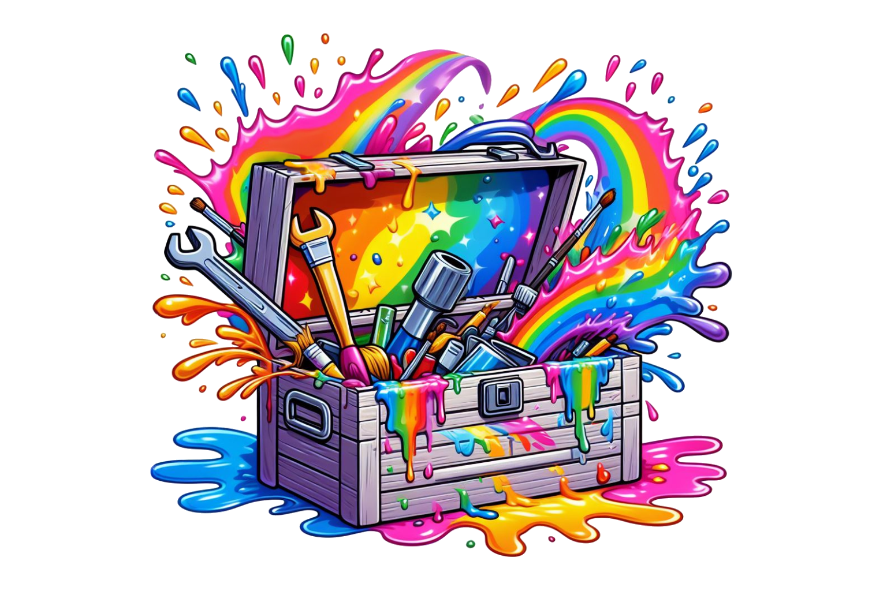
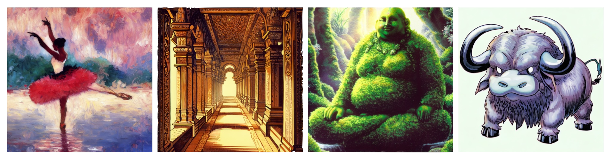
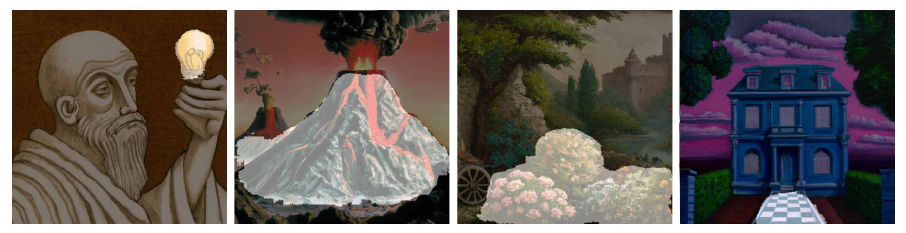

# creative-tools




## Features
- Standardize creative workflows across projects.
- Create, combine, and track data across different modalities.
- Improve productivity and collaboration through organization.
- Refine, edit, and version generated content for re-use.

## Requirements

- [Python >= 3.11](https://www.python.org/downloads/release/python-3110/)
- [Poetry](https://python-poetry.org/)

## Installation

```bash
poetry install
```

## Examples

#### Create a Hugging Face `datasets` Dataset from a DALL-E 2 Collection

The `create_dataset` tool extracts prompts from image filenames using a regular expression to create an iterable text-to-image dataset.
```bash
poetry run python -m creative_tools.create_dataset --input=dalle2-collection ...
```
###### Image

###### Prompt
- *ballerina, painting by claude monet and henri de toulouse-lautrec*
- *water buffalo, 1998 bandai monster illustration, pokemon style manga*
- *ornate temple corridor, 1970s style illustration by randolph caldecott*
- *moss buddha, 1996 konami art illustration*


#### Extract Segmentation Masks from Images using Text Prompts

The `text_to_mask` tool creates segmentation annotations for an image dataset from a set of text prompts.
```bash
poetry run python -m creative_tools.text_to_mask input=custom-dataset text="your mask prompt"
```

###### Prompt
- "*light bulb*"
- "*volcano*"
- "*flowers*"
- "*chess*"

###### Mask


#### Auto-Annotate Images with Existing Text from a Prompt Database

The `prompt_match` tool creates annotations for an image dataset from an existing set of text prompts.
```bash
poetry run python -m creative_tools.prompt_match prompt_file="$DALLE2_DATASET/prompts.txt" images_dir="./data/DALL-E 3" images_src="DALL-E 3"
```

#### Vectorize and Edit Image Color Palettes

The `color_edit` tool vectorizes images and allows for point-and-click color editing of different regions.
```bash
poetry run python -m creative_tools.color_edit ...
```
